# reach

requests that were answered only after the branch, before there was no route

This category is the star of the show, that's why we all are here today.

Newly reachable: 253 out of 5200 requests had no answer before, showing only 15 exemplary illustrations.

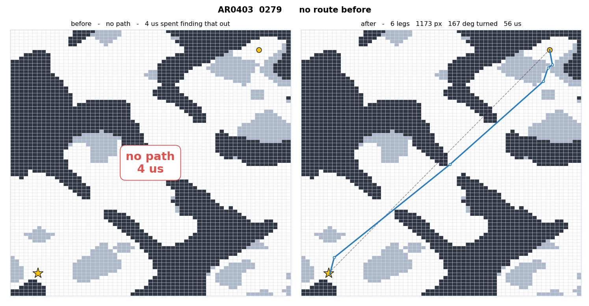

* - *

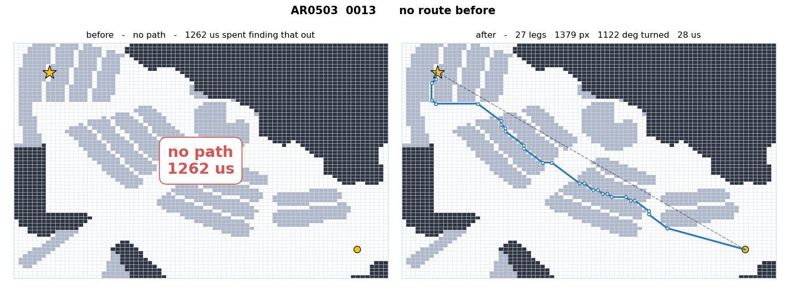

* - *

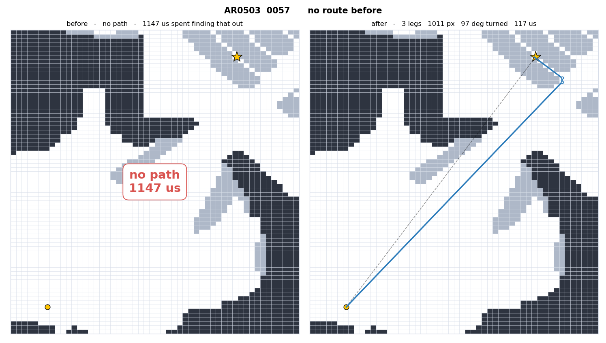

* - *

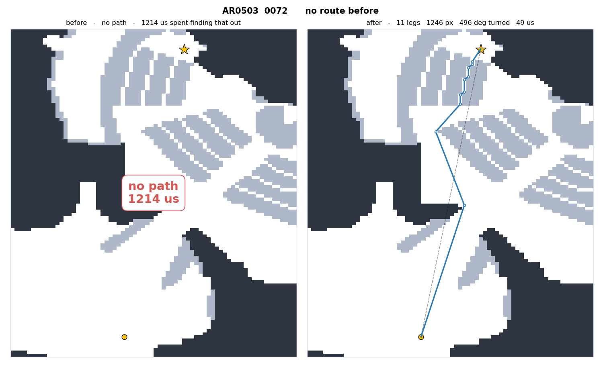

* - *

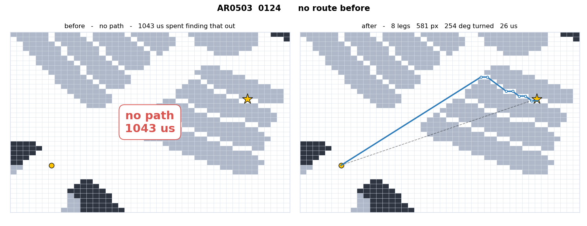

* - *

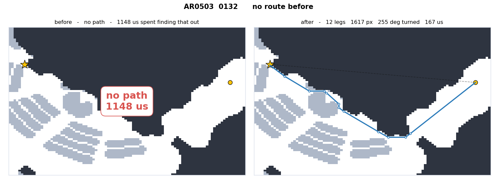

* - *

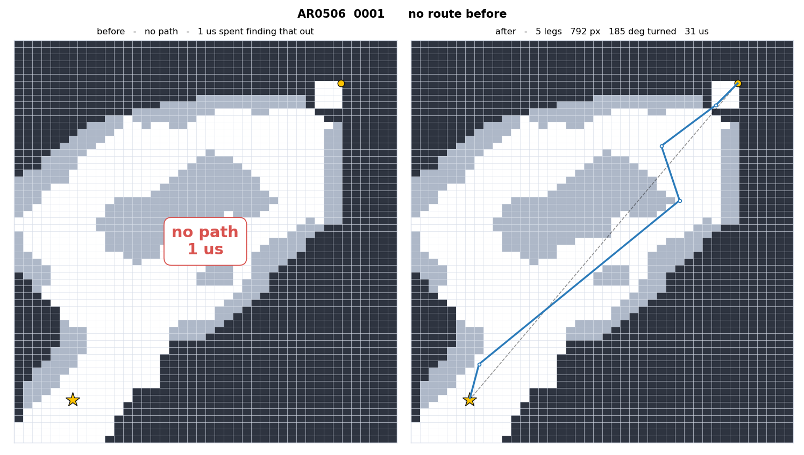

* - *

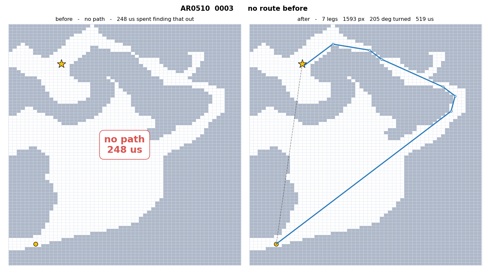

* - *

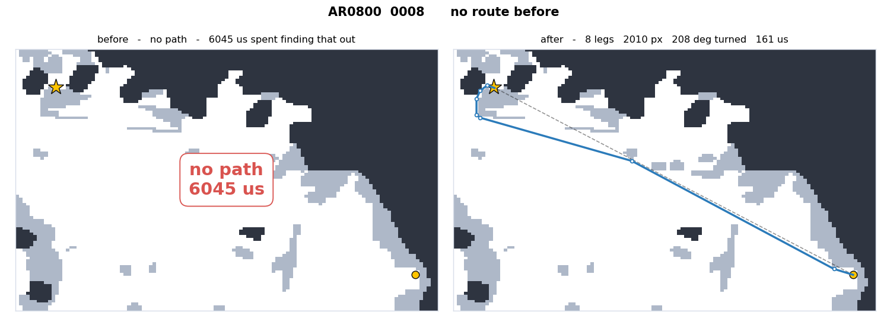

* - *

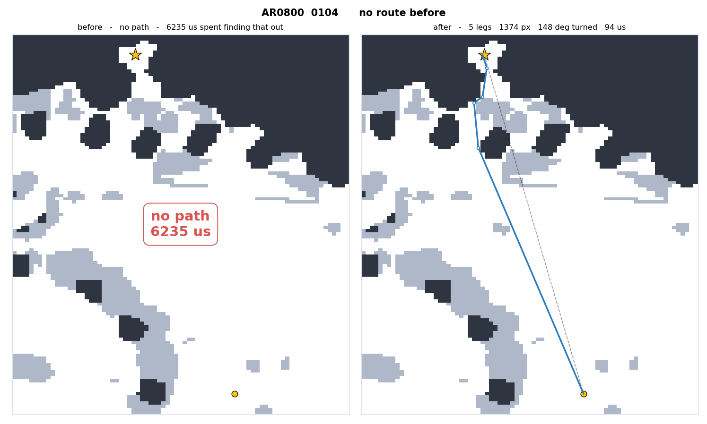

* - *

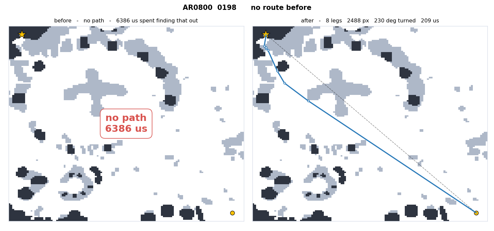

* - *

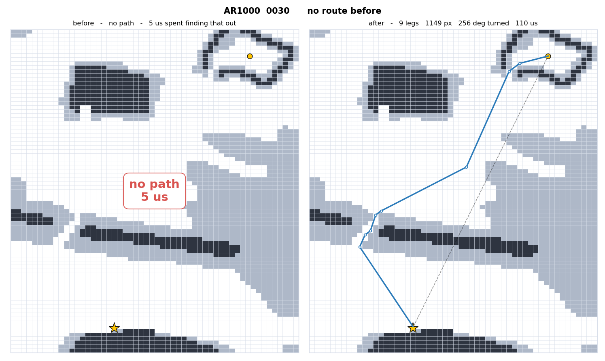

* - *

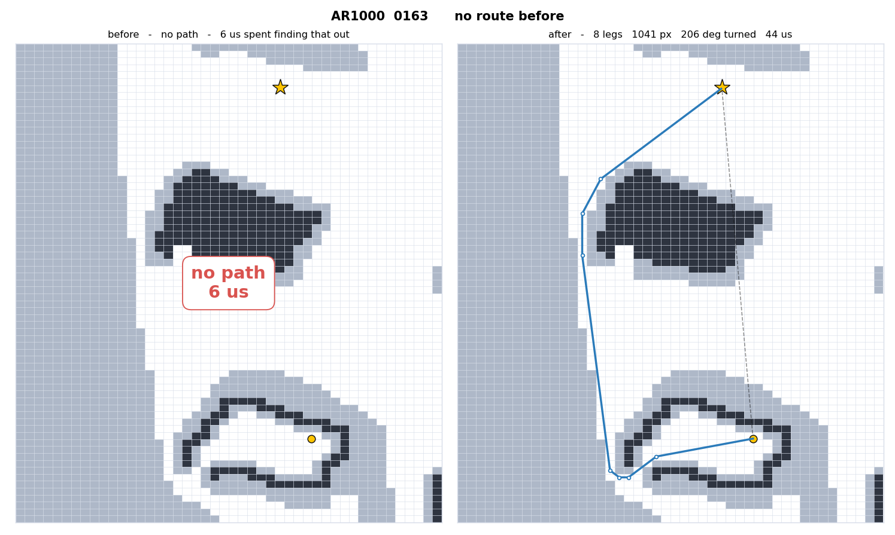

* - *

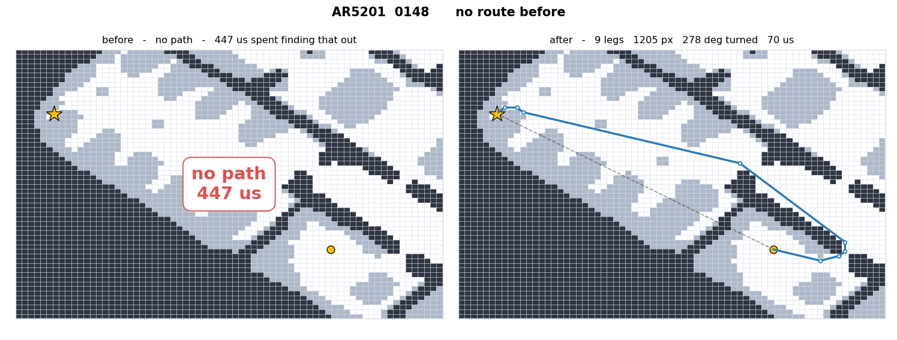

* - *

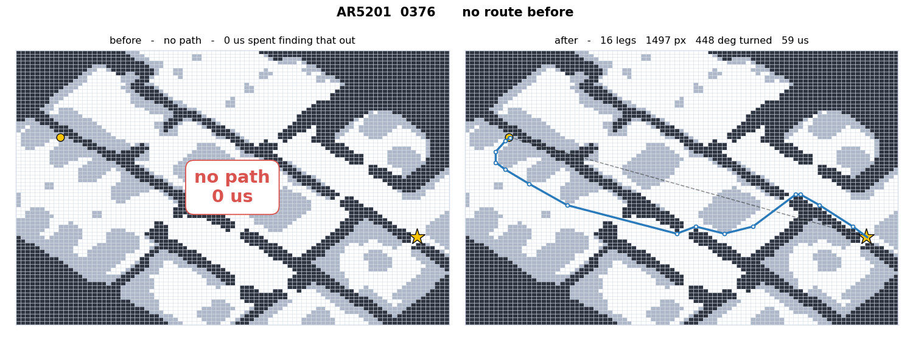

* - *
