# choppier

more legs, more of them under one tile

In general it should produce less legs, but sometimes it just picks sub-optimal (generally shorter, but not always) route. In some cases the diagonal movement enables more legs than before was possible on sharp turns. Big win is that is doesn't introduce its own way of hugging walls, which enabling diagonal neighbours encourages to.

Choppier paths: 39 out of 4663 requests had more one-tile legs, showing only 13 exemplary illustrations.

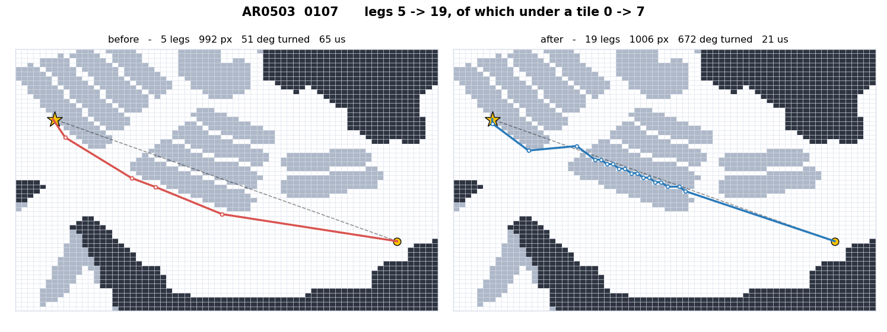

* - *

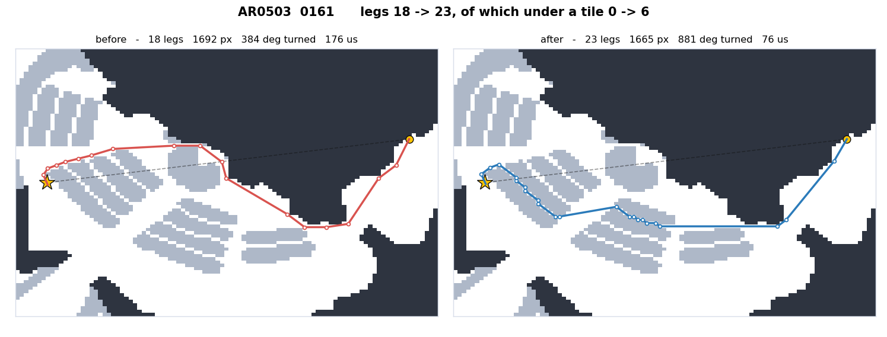

* - *

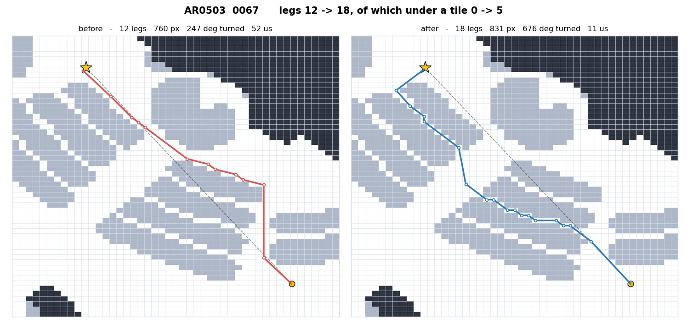

* - *

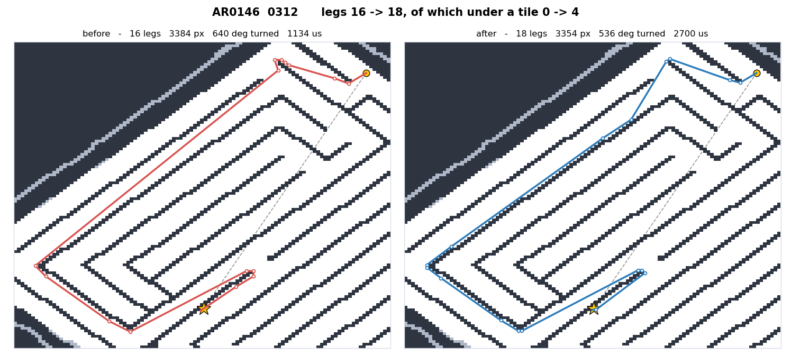

* - *

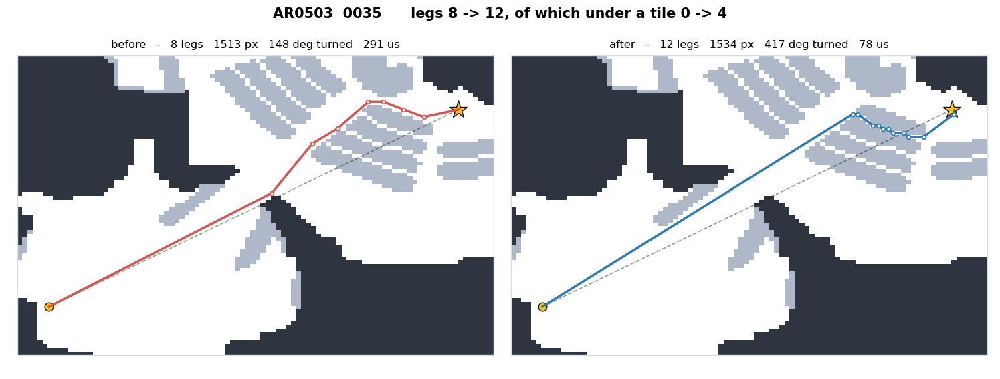

* - *

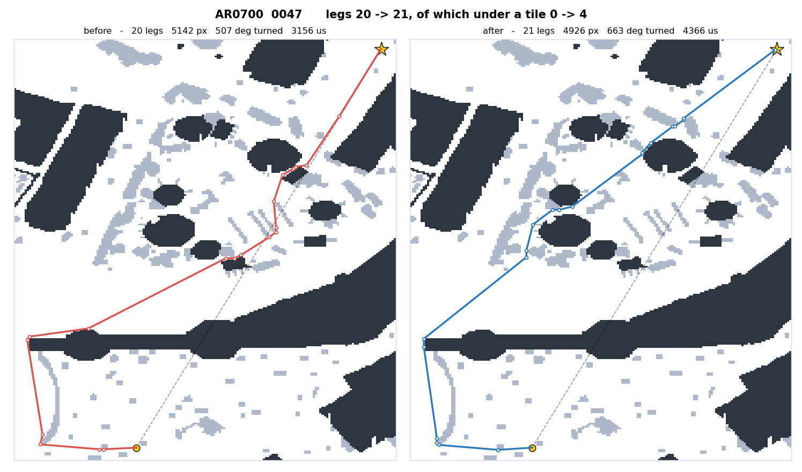

* - *

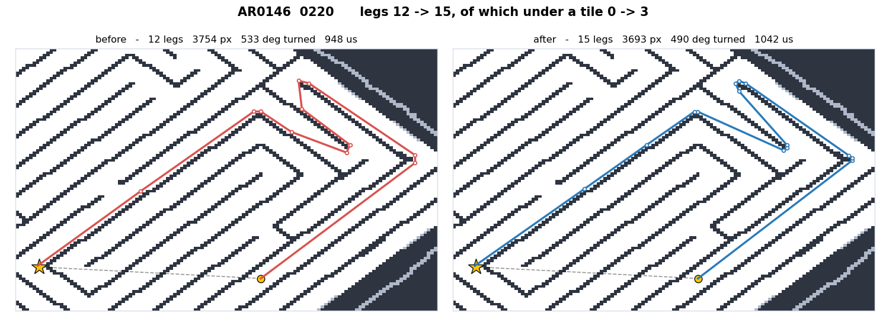

* - *

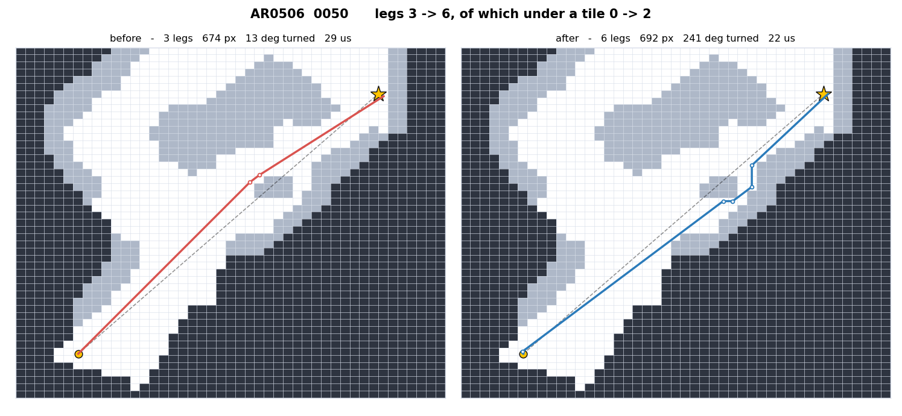

* - *

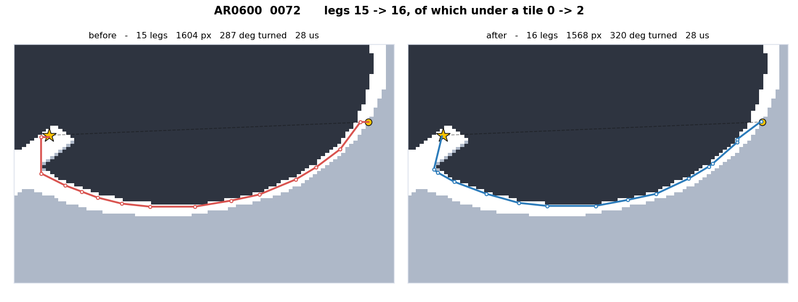

* - *

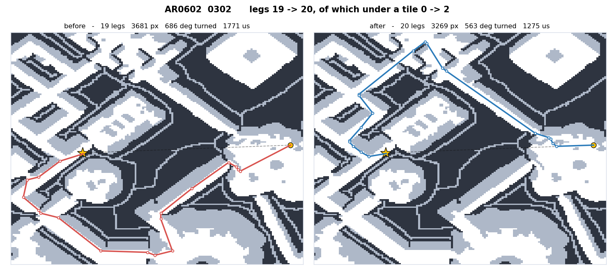

* - *

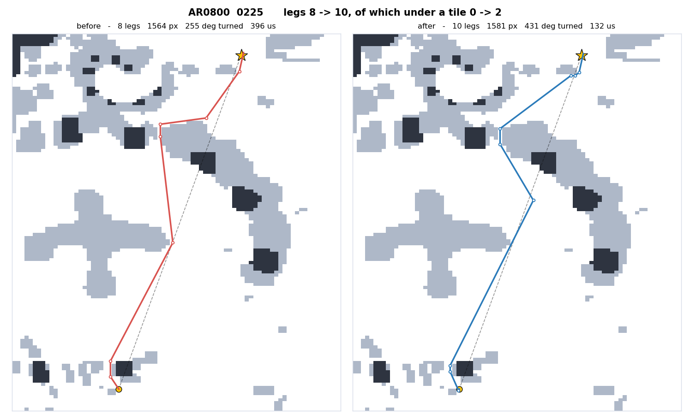

* - *

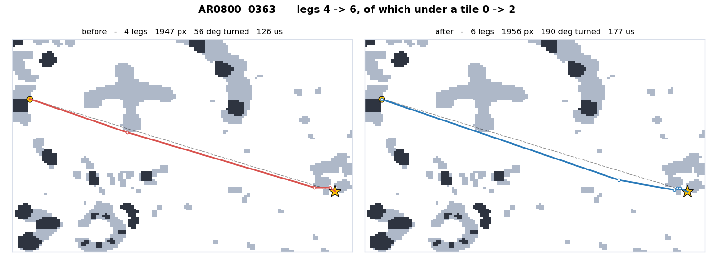

* - *

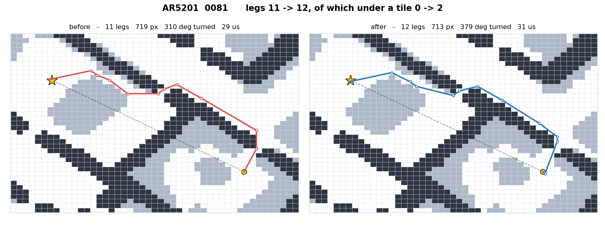

* - *
